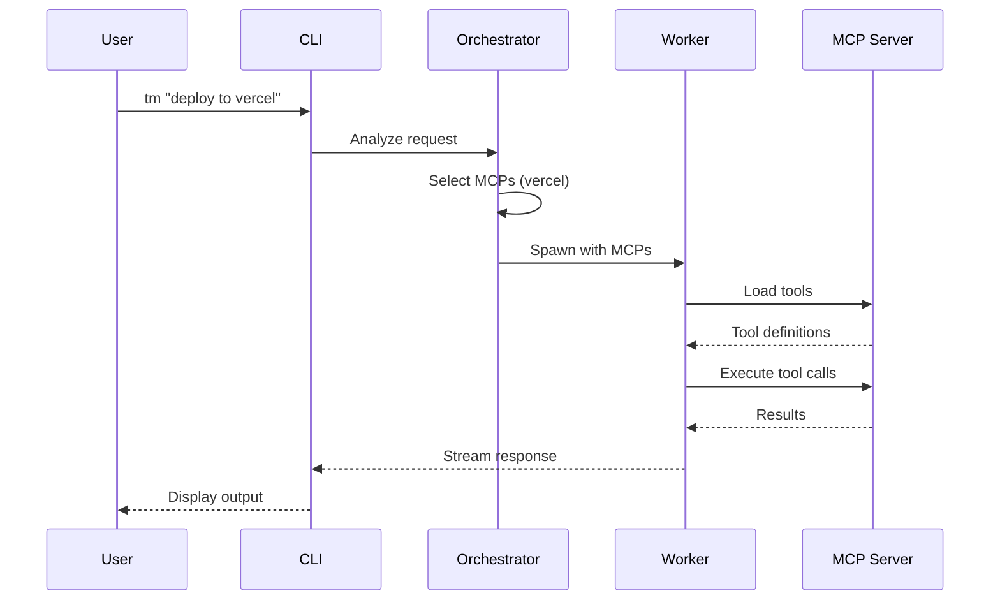

<p align="center">
  
  
  
</p>

<h1 align="center">
  <br>
  TaskMaster CLI
  <br>
</h1>

<h4 align="center">High-performance MCP-enabled agentic CLI built with <a href="https://bun.sh" target="_blank">Bun</a>.</h4>

<p align="center">
  <a href="#key-features">Key Features</a> •
  <a href="#installation">Installation</a> •
  <a href="#quick-start">Quick Start</a> •
  <a href="#commands">Commands</a> •
  <a href="#configuration">Configuration</a> •
  <a href="#architecture">Architecture</a> •
  <a href="#contributing">Contributing</a>
</p>

```
  ████████╗ █████╗ ███████╗██╗  ██╗
  ╚══██╔══╝██╔══██╗██╔════╝██║ ██╔╝
     ██║   ███████║███████╗█████╔╝ 
     ██║   ██╔══██║╚════██║██╔═██╗ 
     ██║   ██║  ██║███████║██║  ██╗
     ╚═╝   ╚═╝  ╚═╝╚══════╝╚═╝  ╚═╝
     High-Performance Agentic CLI
```

---

## Key Features

| Feature | Description |
|---------|-------------|
| 🧠 **Orchestrator-Worker Architecture** | Intelligent task routing with automatic MCP server selection |
| ⚡ **Streaming Responses** | Real-time token streaming for responsive UX |
| 🔀 **Parallel Sub-agents** | Execute independent tasks concurrently with `--parallel` |
| 🛠️ **Specialist Agents** | Dedicated Git and GitHub agents for common developer workflows |
| 🔄 **Multi-IDE MCP Sync** | Import MCP configurations from 11+ IDEs automatically |
| 🎨 **Beautiful CLI UI** | Colored output, spinners, progress bars, and ASCII banners |
| 🔐 **Secure Token Storage** | AES-256-GCM encrypted credentials with platform-native keychains |
| 🌐 **Multi-Transport MCP** | Supports stdio, HTTP, and SSE transports |

---

## Installation

### Prerequisites

- [Bun](https://bun.sh) v1.0.0 or higher
- Node.js 18+ (for some MCP servers)
- Git (for Git specialist agent)
- GitHub CLI `gh` (optional, for GitHub specialist agent)

### Install from Source

```bash
# Clone the repository
git clone https://github.com/AceroBuildAI/Taskmaster.git
cd Taskmaster

# Install dependencies
bun install

# Run directly
bun run start --help

# Or build and install globally
bun run build
bun link
```

### Global Installation

After building, make TaskMaster globally accessible:

```bash
# Option 1: Using bun link (recommended)
bun link

# Option 2: Add to PATH manually
# Windows: Add the dist folder to your PATH environment variable
# macOS/Linux: Add alias to your shell config
echo 'alias tm="bun /path/to/Taskmaster/dist/index.js"' >> ~/.bashrc
```

---

## Quick Start

```bash
# Run a simple query (auto-detects required tools)
tm "what is the capital of France"

# Use Git specialist agent
tm git "how to undo my last commit"

# Use GitHub specialist agent  
tm gh "list my open pull requests"

# Sync MCP servers from your installed IDEs
tm mcp sync

# List available MCP servers
tm mcp list
```

---

## Commands

### General

| Command | Description |
|---------|-------------|
| `tm <prompt>` | Run orchestrator with auto MCP detection |
| `tm run --mcp=<names> <prompt>` | Run worker with specific MCPs |
| `tm setup` | Interactive setup wizard |

### MCP Management

| Command | Description |
|---------|-------------|
| `tm mcp list` | List all registered MCP servers |
| `tm mcp sync` | Import MCPs from installed IDEs |
| `tm mcp auth <name>` | Authenticate an MCP server (OAuth) |

### Specialist Agents

| Command | Description |
|---------|-------------|
| `tm git <prompt>` | Git CLI specialist agent |
| `tm git --execute <prompt>` | Execute suggested Git commands |
| `tm gh <prompt>` | GitHub specialist agent |

### Options

| Flag | Description |
|------|-------------|
| `--heavy`, `-h` | Use heavy model (Gemini Pro) instead of lite (GLM Flash) |
| `--parallel` | Enable parallel sub-agent execution |
| `--execute` | Execute suggested commands (Git agent only) |
| `--mcp=<names>` | Comma-separated list of MCP servers |
| `--help` | Show help message |

---

## Configuration

TaskMaster stores configuration in `~/.taskmaster/`:

| File | Description |
|------|-------------|
| `config.json` | MCP server registry |
| `tokens.enc` | AES-256-GCM encrypted OAuth tokens |
| `master.key` | Encryption key (Windows: file, macOS: Keychain, Linux: Secret Service) |

### Supported IDEs for MCP Sync

TaskMaster can automatically import MCP configurations from:

| IDE | Config Location | Status |
|-----|-----------------|--------|
| Gemini CLI | `~/.gemini/settings.json` | ✅ Supported |
| Claude Desktop | Platform-specific | ✅ Supported |
| Cursor | `~/.cursor/mcp.json` | ✅ Supported |
| VS Code | `settings.json` | ✅ Supported |
| VS Code Insiders | `settings.json` | ✅ Supported |
| Windsurf | `~/.codeium/windsurf/mcp_config.json` | ✅ Supported |
| Zed | `~/.config/zed/settings.json` | ✅ Supported |
| Continue | `~/.continue/config.json` | ✅ Supported |
| Amp | `~/.ampcode/settings.json` | ✅ Supported |
| Cline (VS Code) | Extension storage | ✅ Supported |
| Roo Cline | Extension storage | ✅ Supported |

---

## Architecture

```
┌─────────────────────────────────────────────────────────────────────┐
│                           CLI Entry Point                           │
│                          (src/index.ts)                             │
├─────────────────────────────────────────────────────────────────────┤
│                                                                     │
│  ┌─────────────────┐    ┌─────────────────┐    ┌────────────────┐  │
│  │   Orchestrator  │───▶│  Worker Pool    │───▶│   MCP Loader   │  │
│  │  (Task Router)  │    │ (Parallel Exec) │    │  (Tool Bridge) │  │
│  └─────────────────┘    └─────────────────┘    └────────────────┘  │
│                                                                     │
├─────────────────────────────────────────────────────────────────────┤
│                        Specialist Agents                            │
│  ┌─────────────────┐    ┌─────────────────┐    ┌────────────────┐  │
│  │   Git Agent     │    │  GitHub Agent   │    │  Custom Agent  │  │
│  │  (CLI Expert)   │    │  (API Expert)   │    │   (Extend)     │  │
│  └─────────────────┘    └─────────────────┘    └────────────────┘  │
│                                                                     │
├─────────────────────────────────────────────────────────────────────┤
│                          Infrastructure                             │
│  ┌─────────────────┐    ┌─────────────────┐    ┌────────────────┐  │
│  │  MCP Registry   │    │  Token Storage  │    │   IDE Sync     │  │
│  │  (Server List)  │    │  (Encrypted)    │    │   (11+ IDEs)   │  │
│  └─────────────────┘    └─────────────────┘    └────────────────┘  │
│                                                                     │
├─────────────────────────────────────────────────────────────────────┤
│                          AI Providers                               │
│  ┌─────────────────┐    ┌─────────────────┐                        │
│  │  Gemini Pro     │    │  Zhipu GLM      │                        │
│  │  (Heavy Model)  │    │  (Lite Model)   │                        │
│  └─────────────────┘    └─────────────────┘                        │
└─────────────────────────────────────────────────────────────────────┘
```

### Data Flow



---

## Development

```bash
# Install dependencies
bun install

# Run in development mode (with watch)
bun run dev

# Run directly
bun run start <command>

# Type checking
bun run typecheck

# Build bundle (for bun runtime)
bun run build

# Build standalone executable
bun run build:standalone

# Run tests
bun test
```

### Project Structure

```
src/
├── index.ts              # CLI entry point
├── cli/
│   └── ui.ts             # Terminal UI utilities
├── agent/
│   ├── orchestrator.ts   # Task routing & planning
│   ├── worker.ts         # Task execution
│   └── specialists/      # Domain-specific agents
│       ├── git-agent.ts
│       └── github-agent.ts
├── mcp/
│   ├── registry.ts       # MCP server registry
│   ├── loader.ts         # MCP client loader
│   ├── auth.ts           # OAuth authentication
│   └── token-storage.ts  # Secure token storage
├── providers/
│   ├── gemini-provider.ts
│   └── zhipu-provider.ts
├── sync/
│   └── engine.ts         # IDE config sync
├── clients/
│   ├── definitions.ts    # IDE definitions
│   └── discovery.ts      # IDE discovery
└── security/
    └── validator.ts      # Input validation
```

---

## Security

- **Token Encryption**: All OAuth tokens are encrypted with AES-256-GCM
- **Platform Keychain**: Master key stored in Windows DPAPI / macOS Keychain / Linux Secret Service
- **Input Validation**: All MCP server names and commands are validated
- **No Secrets in Logs**: Sensitive data is never logged

---

## Troubleshooting

### Common Issues

**MCP server connection failed**
```bash
# Check server status
tm mcp list

# Re-sync from IDEs
tm mcp sync

# Re-authenticate
tm mcp auth <server-name>
```

**API key not found**
```bash
# Run setup wizard
tm setup

# Or set environment variable
export ZHIPU_API_KEY=your-key
```

**Git agent not finding git**
```bash
# Ensure git is in PATH
which git
```

---

## Contributing

Contributions are welcome! Please read our [Contributing Guide](CONTRIBUTING.md) first.

1. Fork the repository
2. Create your feature branch (`git checkout -b feature/amazing-feature`)
3. Commit your changes (`git commit -m 'Add amazing feature'`)
4. Push to the branch (`git push origin feature/amazing-feature`)
5. Open a Pull Request

---

## License

MIT License - see [LICENSE](LICENSE) for details.

---

## Acknowledgments

- [Bun](https://bun.sh) - JavaScript runtime & toolkit
- [Vercel AI SDK](https://sdk.vercel.ai/) - AI integration framework
- [MCP Protocol](https://modelcontextprotocol.io/) - Model Context Protocol

---

<p align="center">
  Made with ❤️ by <a href="https://github.com/AceroBuildAI">AceroBuild AI</a>
</p>
